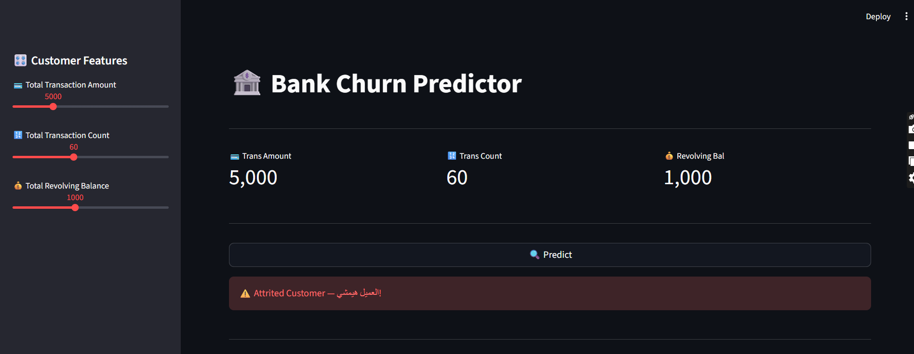
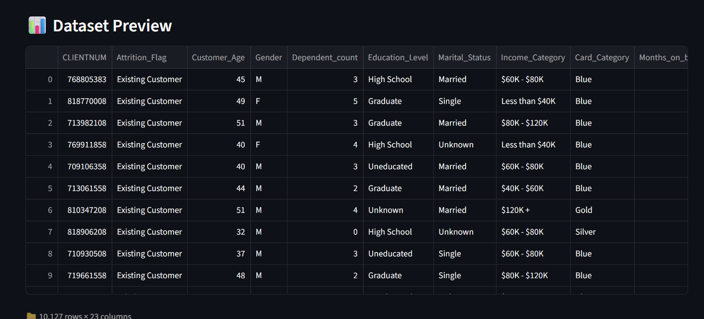
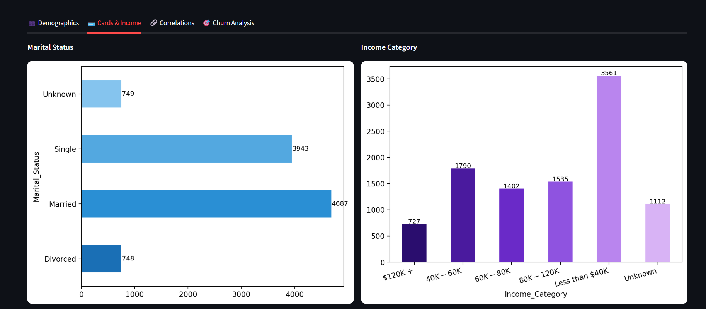

# 🏦 Bank Customer Churn Prediction — End-to-End ML Project

![Python]





---

## 📌 Project Overview

This is a **complete end-to-end machine learning project** that predicts whether a bank customer will churn (leave) or stay, using real credit card customer data. The project covers the full ML pipeline — from raw data exploration and cleaning, through model training and evaluation, all the way to a deployed interactive web application built with Streamlit.

The goal is to help banks proactively identify at-risk customers before they leave, enabling targeted retention strategies.

---

## 🔄 End-to-End Pipeline

```
Raw Data (CSV)
     │
     ▼
📊 Exploratory Data Analysis (EDA)
     │  - Distribution analysis
     │  - Correlation heatmap
     │  - Churn rate by demographics
     ▼
🧹 Data Preprocessing
     │  - Drop irrelevant columns (Naive Bayes classifiers)
     │  - Handle Unknown values
     │  - Label Encoding for categorical features
     ▼
🤖 Model Training
     │  - Feature selection (Top 3 most predictive features)
     │  - Random Forest Classifier
     │  - class_weight='balanced' to handle imbalanced data
     ▼
📈 Model Evaluation
     │  - Classification Report
     │  - Confusion Matrix
     ▼
🚀 Deployment
        - Streamlit interactive web app
        - Real-time prediction with sliders
        - Live dashboard with all EDA charts
```

---

## 📁 Project Structure

```
Credit Card Customers/
│
├── BankChurners.csv          # Raw dataset (10,127 customers)
├── Analysis.ipynb            # Full EDA + model training notebook
├── App.py                    # Streamlit web application
├── model_simple.pkl          # Saved trained model (joblib)
├── README.md                 # Project documentation
├── Image/ 
└── Video/               
```

---

## 📊 Dataset

- **Source:** BankChurners dataset
- **Size:** 10,127 customers × 21 features
- **Target:** `Attrition_Flag` — Existing Customer vs Attrited Customer
- **Class imbalance:** ~83.9% Existing / ~16.1% Attrited

Key features used for prediction:

| Feature | Description |
|---|---|
| `Total_Trans_Amt` | Total transaction amount in the last 12 months |
| `Total_Trans_Ct` | Total number of transactions in the last 12 months |
| `Total_Revolving_Bal` | Total revolving balance on the credit card |

---

## 🤖 Model

- **Algorithm:** Random Forest Classifier
- **Key Parameters:**
  - `n_estimators=100`
  - `max_depth=10`
  - `class_weight='balanced'` — handles the imbalanced dataset
  - `random_state=42`
- **Train/Test Split:** 80% / 20%

---

## 🚀 Streamlit App Features

The deployed app includes:

**🎛️ Sidebar — Live Prediction**
- 3 interactive sliders for each input feature
- Real-time churn prediction on button click
- Clear result: ✅ Customer will stay / ⚠️ Customer will leave

**📊 Dashboard Tabs**
- **Demographics** — Gender distribution, Churn ratio, Education level, Marital status
- **Cards & Income** — Income category, Card types, Age vs Card category, Gender vs Card type
- **Correlations** — Full correlation heatmap + Confusion matrix
- **Churn Analysis** — Churn rate broken down by all categorical features

---

## ⚙️ How to Run

**1. Clone the repository**
```bash
git clone https://github.com/your-username/bank-churn-prediction.git
cd bank-churn-prediction
```

**2. Install dependencies**
```bash
pip install streamlit pandas numpy scikit-learn matplotlib seaborn joblib
```

**3. Run the app**
```bash
streamlit run App.py
```

---

## 📦 Requirements

```
streamlit
pandas
numpy
scikit-learn
matplotlib
seaborn
joblib
```

---

## 👨‍💻 Author

Built as part of the **ITI Data Analysis & Visualization using Python** program.

---

## 📄 License

This project is open source and available under the [MIT License](LICENSE).
